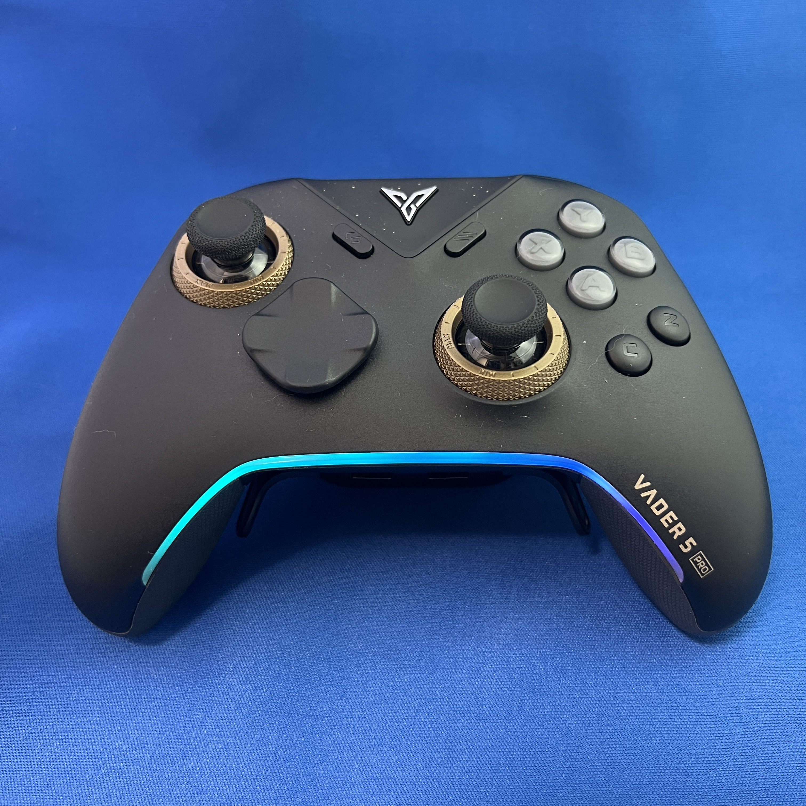
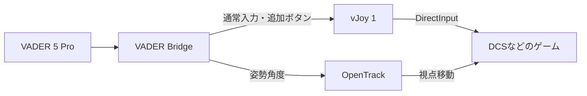
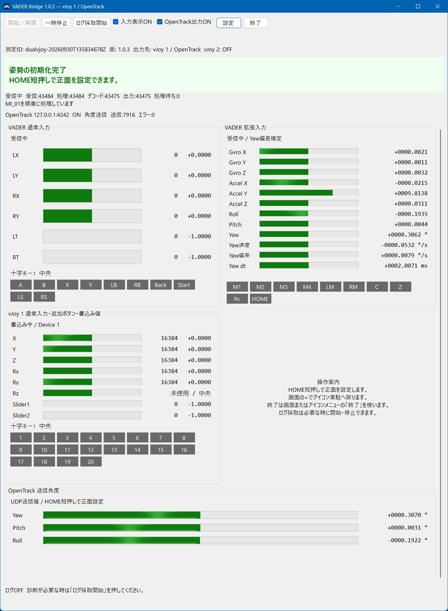
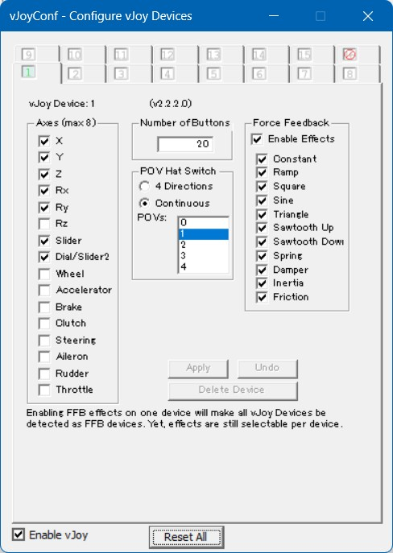
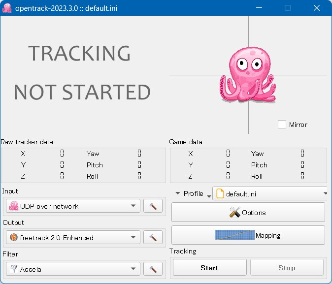
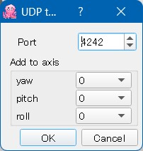

# Vader5ProInputBridge


VADER 5 PROの入力をvJoy（仮想ゲームコントローラー）へ、姿勢角度をOpenTrackへ送るWindowsアプリです。初期対象はUSB接続のVADER 5 PRO。現在の版は**1.0.6**です。

本プロジェクトは、個人が開発・保守する非公式ツールです。（Flydigiの公式製品ではなく、同社との提携関係や同社による承認はありません。）

**ダウンロード：[最新版のRelease](https://github.com/FuyukiYoneyama/Vader5ProInputBridge/releases/latest)**。実行用の`VADERBridge-1.0.6.zip`と、照合用の同名`.sha256`を入手してください。



## 想定される利用例

DCS（フライトシミュレーター）などで、VADER 5 ProをDirectInput（D-input：Windowsのゲームコントローラー読取り方式）の多ボタンゲームパッドとして使いながら、パッドの向きで視点を動かす使い方を想定しています。

スティック・トリガー・20ボタンをvJoy 1からゲームへ入力し、同時にジャイロと加速度から計算した姿勢角度をOpenTrackへ送ることで、操縦操作と視点移動を併用できます。



## 主な機能

- 通常入力と追加ボタンをvJoy 1へ統合。20ボタン、スティック、独立トリガー、十字キーを出力。
- ジャイロと加速度からYaw（左右へ向きを変える回転）、Pitch（前後の傾き）、Roll（左右の傾き）を計算し、OpenTrackへ送信。
- HOME短押しで正面を更新。
- 起動後に取得と出力を自動開始し、通知領域（時計の横のアイコン欄）へ常駐。
- 固定入力表示、表示ON／OFF、一時停止／再開、必要な区間のログ採取。
- 接続回復中は最終値を保持し、再接続後に更新を再開。

## 画面例

通常入力・追加ボタン、vJoy 1へ書き込む値、OpenTrackへ送る角度を固定表示します。

<details>
<summary>Bridgeの状態画面を表示（1.0.3で撮影）</summary>



画面例は1.0.3で撮影したものです。使用する版はタイトルと画面内の版表示で確認します。

</details>

## 動作に必要な環境

| 用意するもの | 内容・入手先 |
|---|---|
| PC | Windows x64（64ビット） |
| VADER 5 Pro | USBでPCへ接続。初期対象はUSB接続 |
| .NET 10 | **.NET Desktop Runtime（Windowsアプリの実行環境）10 / Windows x64**。[Microsoftのダウンロードページ](https://dotnet.microsoft.com/en-us/download/dotnet/10.0)で「.NET Desktop Runtime」→「Windows」→「x64」を選ぶ |
| vJoy | 仮想ゲームコントローラーを作るドライバー。設定画面例は2.2.2.0。[配布元のReleases](https://github.com/BrunnerInnovation/vJoy/releases) |
| OpenTrack | Bridgeから受けた姿勢角度をゲームの視点移動へつなぐアプリ。[配布元のReleases](https://github.com/opentrack/opentrack/releases) |

配布用ZIPを使う場合は上の実行環境を用意します。ソースからビルドする場合は、後述の開発環境を用意します。インストーラーがPC再起動を案内した場合は、再起動後に設定を進めます。

### vJoyの役割と設定

vJoyは、Windowsに仮想のゲームパッドを登録するソフトです。BridgeがVADERの入力を書き込み、ゲームはそのvJoyをDirectInputのゲームパッドとして読み取ります。現在の構成では**Device 1に通常入力と追加ボタンをまとめます**。

1. vJoyをインストールし、Bridgeを終了した状態でvJoyConf（vJoyの機器設定ツール）を開きます。
2. 上部の「1」を選び、次の表のとおり設定します。
3. 左下の「Enable vJoy」をONにし、「Apply」で保存して画面を閉じます。

| 項目 | 設定 |
|---|---|
| Axes（軸） | X、Y、Z、Rx、Ry、Slider、Dial/Slider2をON |
| Number of Buttons（ボタン数） | 20 |
| POV Hat Switch（十字キーの方向入力） | Continuous（角度指定）を選び、POVsを1 |
| Rz | OFF。有効な場合は中央を保持 |
| Force Feedback（振動・力覚のフィードバック） | 入力設定とは独立。画面例のEnable EffectsはON |

（このBridgeはゲームからの振動・力覚をVADERへ中継しません。）vJoy 2への出力は既定でOFFです。

<details>
<summary>vJoyの設定画面例（2.2.2.0）</summary>



</details>

### OpenTrackの設定

OpenTrackの入力を、Bridgeが送るUDP（アプリ間でデータを送る通信方式）に合わせます。次の表は添付画面と同じ設定例です。

| 項目 | 設定 |
|---|---|
| Input（入力方式） | **UDP over network** |
| Input横の工具ボタン → Port（受信ポート） | **4242**。Bridgeの既定送信先は同じPCの`127.0.0.1:4242` |
| Add to axis（受信角度へ加える補正） | yaw、pitch、rollをすべて**0** |
| Output（ゲームへの出力方式） | 使用するゲームに合わせる。画面例は**freetrack 2.0 Enhanced** |
| Filter（動きを滑らかにする処理） | 画面例は**Accela**。操作感に合わせて調整 |

「Start」で追跡を開始します。パッドを動かして「Raw tracker data（受信した姿勢角度）」が変化し、「Game data（ゲームへ送る値）」にも反映されることを確認します。視点の動く量は「Mapping（入力角度とゲーム内の視点角度の対応）」で調整できます。[OpenTrackの公式設定ガイド](https://github.com/opentrack/opentrack/wiki/Quick-Start-Guide-(WIP))も参照できます。

<details>
<summary>OpenTrackの設定画面例（2023.3.0）</summary>





</details>

### Bridgeを起動して使う

BridgeはVADERの拡張入力（追加ボタン・ジャイロなどの入力）を取得し、通常入力と追加ボタンをvJoy 1へ送ります。**Bridge使用中は、ゲーム側でvJoy 1のDirectInput入力を割り当てて使用してください。**

（拡張入力の取得中は、VADER側の仕様により、パッドの標準XInput（Windows標準ゲームパッドの読取り方式）出力が停止します。これは拡張入力の取得要求に対するVADER側の動作であり、BridgeにXInput出力を停止させる処理を実装したものではありません。）

1. 配布用ZIPを書込み可能なフォルダーへ展開し、`VADERBridge.exe`を起動します。
2. 初期化の案内に従い本体を約2秒静止させ、HOMEを短く押して離します。
3. ゲーム側でvJoy 1のボタン・軸を割り当て、OpenTrackの追跡を開始して使用します。
4. 通知領域のアイコンをダブルクリックすると状態画面が開きます。終了はアイコンメニューの「終了」を使用します。

ログの初期値はOFFです。

（配布EXEにはAuthenticode（Windowsで発行元を確認するコード署名）を付けていません。）Windows SmartScreen（ダウンロードしたアプリの評判を確認する機能）が警告を表示する場合があります。[Microsoftの説明](https://learn.microsoft.com/en-us/windows/security/operating-system-security/virus-and-threat-protection/microsoft-defender-smartscreen/)を参照してください。配布ZIPの内容はReleaseに添付するSHA-256（ファイル内容の識別値）で照合できます。手順は[利用ガイド](docs/USAGE.md#配布物の確認)を参照してください。

[利用ガイドと割当](docs/USAGE.md) · [変更履歴](CHANGELOG.md)

## ビルド

.NET 10 SDK（ソースをビルドする開発キット）、Git、PowerShell 7を用意し、リポジトリ直下で実行します。

```powershell
.\build-apps.ps1
```

通常の起動先は`apps/VADERBridge/VADERBridge.exe`。診断用の読取りアプリとVaderHidProbeも`apps/`へ生成します。vJoyは実行時にインストール済みのライブラリを読み込みます。

[開発・公開手順](docs/DEVELOPMENT.md) · [構成と通信仕様](docs/ARCHITECTURE.md) · [貢献方法](CONTRIBUTING.md)

## ソース構成

| フォルダー | 内容 |
|---|---|
| `src/VaderBridge` | 取得、入力処理、vJoy出力、姿勢計算、常駐画面 |
| `src/InputTools.Common` | 固定表示、記録、Windows入力の読取り |
| `src/DInputReader` | DirectInputによるvJoyの診断 |
| `src/XInputReader` | XInputの診断 |
| `src/VaderHidProbe` | HID（機器の入力・制御用インターフェース）の列挙と生入力の診断 |
| `config` | 共有する既定設定 |
| `docs` | 利用・開発・通信仕様 |
| `tools` | アイコン生成と公開内容の監査 |
| `licenses` | 参照元のライセンス本文 |

実機ログは`logs/`、個別設定は`config/application.json`へ保存します。ローカルの実験資料は`private/`に保管し、これらの保存先をGitの除外設定で扱います。

## 動作条件と継続改善

| 項目 | 動作と評価の範囲 |
|---|---|
| 接続 | USB有線を初期対象とし、USBドングルの再接続も評価対象としています |
| 外部アプリ | 設定画面例はvJoy 2.2.2.0、OpenTrack 2023.3.0。機器のファームウェアと外部アプリの版を測定条件として記録します |
| 初期化 | 静止した本体から約2秒でYawの偏差を決めます。5秒を超える待機は、画面の理由と通知領域の状態を確認します |
| USB再接続 | これまでの確認では、動作と停止を繰り返し、安定まで約20～30秒かかる例がありました。回復中は最終値を保持します |
| 姿勢 | Yawは角速度の積算による微小ドリフトがあります。HOME短押しで使用する方向を正面として更新できます |
| 通常入力 | 本アプリ使用中は、通常入力と追加ボタンをvJoy 1のDirectInput経路で使います |

VADER側の拡張入力取得時の仕様と使用する入力経路は、[Bridgeを起動して使う](#bridgeを起動して使う)に記載しています。取得方式や機器の版による標準XInputと拡張入力の同時更新は、継続評価の対象としています。

1.0.4で入力処理の例外回復、vJoyの再取得、ログ記録と配布内容を修正し、1.0.5で.NET 10への移行と公開工程の更新を行っています。USB再接続の安定時間とYawのドリフトは、各版の実機確認で継続評価します。確認手順は[利用ガイド](docs/USAGE.md#版を更新した後の確認)にまとめています。

## ライセンスと出典

本プロジェクトのソースと文書は[MITライセンス](LICENSE)です。著作権者はFUYUKI YONEYAMA。

「Flydigi」「VADER 5 Pro」などのメーカー名・製品名は、対象機器や連携先を識別するために使用しています。[VADER 5 Proの公式製品ページ](https://shops.flydigi.com/products/vader5pro)も参照できます。記載されている製品名・商標・ロゴに関する権利は、それぞれの権利者に帰属します。

SDLのFlydigi実装を参照した部分は、元の著作権表示とZlibライセンスも保持しています。参照箇所・外部アプリ・配布範囲は[第三者の著作権表示](THIRD_PARTY_NOTICES.md)にまとめています。
